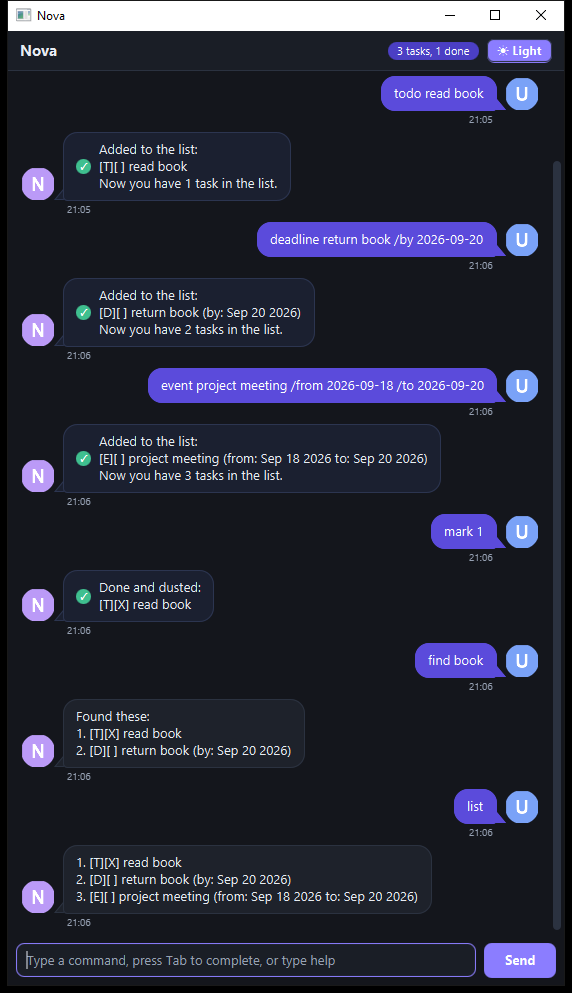

# Nova User Guide



Nova is a desktop task list that you talk to. Type a short command, and Nova adds
your task, shows your list, marks things done or finds what you are looking for.
Everything is saved on your computer, so your list is still there the next time
you open Nova.

## Quick start

1. Make sure you have Java 25 installed (`java -version`).
2. Download `nova.jar` from the [latest release](https://github.com/Keerthivasan152/ip/releases).
3. Open a terminal in the folder holding the jar and run `java -jar nova.jar`
   (running it from a terminal avoids problems with double-clicking).
4. Type a command such as `todo read book` in the box at the bottom and press Enter.
5. Type `bye` to close Nova. Your tasks are saved after every change, so nothing is lost.

Note: the jar bundles the JavaFX libraries for Windows, Linux and Intel Macs. On an
Apple Silicon Mac (M1 and later), run it with the x64 build of Java 25, because the
bundled JavaFX libraries are x86-64.

## Adding tasks

Add a task with no date:

```
todo read book
```
```
Added to the list:
[T][ ] read book
Now you have 1 task in the list.
```

Add a task with a deadline, using `/by` and a date in `yyyy-MM-dd`:

```
deadline return book /by 2026-09-20
```
```
Added to the list:
[D][ ] return book (by: Sep 20 2026)
Now you have 2 tasks in the list.
```

Add a task that runs between two dates, using `/from` and `/to`:

```
event project meeting /from 2026-09-18 /to 2026-09-20
```
```
Added to the list:
[E][ ] project meeting (from: Sep 18 2026 to: Sep 20 2026)
Now you have 3 tasks in the list.
```

The `/from` date must come before the `/to` date, and both dates have to be real
dates: `2026-02-30` is rejected.

## Seeing your tasks

`list` shows every task, numbered from 1:

```
list
```
```
1. [T][X] read book
2. [D][ ] return book (by: Sep 20 2026)
3. [E][ ] project meeting (from: Sep 18 2026 to: Sep 20 2026)
```

`[T]` is a todo, `[D]` a deadline and `[E]` an event. `[X]` marks a task that is
done, `[ ]` one that is not.

`find` shows only the tasks whose description contains your keyword, and it
ignores upper and lower case:

```
find book
```
```
Found these:
1. [T][X] read book
2. [D][ ] return book (by: Sep 20 2026)
```

## Changing your tasks

- `mark 2` marks task 2 as done and answers `Done and dusted:` with the task.
- `unmark 2` marks it as not done again and answers `Back to pending:`.
- `delete 2` removes it from the list and answers `Removed:`.
- `archive` moves every completed task to the archive file and removes it from
  the list, so a long list stays tidy:

```
archive
```
```
Tidied up. These completed tasks are now in the archive:
1. [T][X] read book
Now you have 2 tasks in the list.
```

If nothing is completed, Nova says so and changes nothing.

## Getting help while you work

- `help` lists every command with its parameters.
- The up and down arrow keys walk back and forward through the commands you
  typed, like a terminal.
- Tab completes a half-typed command: type `de` and press Tab to get `deadline `.
- Ctrl+D switches between the dark and the light theme, and Nova remembers your
  choice, along with the size and position of the window.

## The window

- The header shows the product name, a count of your tasks (`3 tasks, 1 done`)
  and the theme switch.
- Your turns appear on the right in a filled bubble; Nova's replies appear on the
  left with a small avatar, a tail, a timestamp and a marker: a tick for a
  command that changed something, a `!` for a problem.
- The box at the bottom takes the command, and the Send button or Enter sends it.

## Saving

Nova saves after every change, in a file called `nova.txt` inside a `data` folder
next to where you started Nova. Archived tasks go to `data/nova-archive.txt`.
Both files are plain text, one task per line, and can be moved with the folder.

If Nova cannot read or write those files, it tells you in the chat instead of
failing silently, for example when a line of the file is damaged or the folder
cannot be created.

## Command summary

- `todo DESCRIPTION` adds a todo, e.g. `todo read book`
- `deadline DESCRIPTION /by DATE` adds a task with a deadline
- `event DESCRIPTION /from DATE /to DATE` adds an event
- `list` shows all tasks
- `find KEYWORD` shows the tasks matching a keyword
- `mark NUMBER` marks a task as done
- `unmark NUMBER` marks it as not done
- `delete NUMBER` removes a task
- `archive` moves completed tasks to the archive file
- `help` shows this list in the app
- `bye` saves and closes Nova

## Errors you may see

Nova explains what is wrong and shows the shape of a correct command:

```
deadline return book /by 2026-13-45
```
```
That date doesn't look right. Use yyyy-MM-dd, e.g. deadline return book /by 2026-08-28
```

Wrong input never changes your list, so it is always safe to try again.
